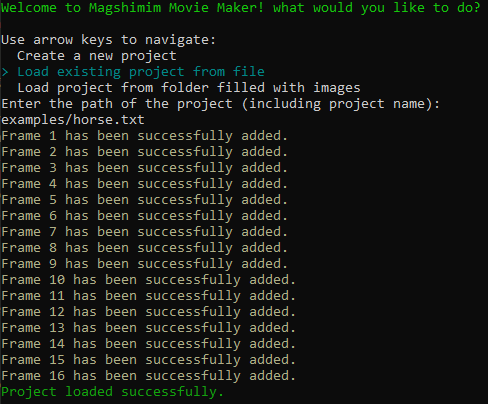
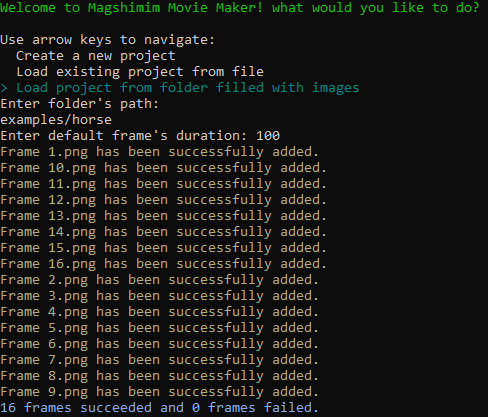

# GIF Maker

## Description

Final project for Magshimim (Israel National Cyber ​​Enrichment Program)  
This program allows the user to manage movies/gifs.  

# List of features:
* Add a frame
* Remove a frame
* Chanage the location of a frame (its index)
* Change the duration of a specific frame
* Change the duration to all frames at once
* List the frames (get info for all the frames in your project)
* Gray-scale filter manager:
  * Apply the filter to a specific frame
  * Remove the filter from a specific frame
  * Apply the filter to all frames
  * Remove the filter from all frames
* Play the movie
* Play the movie in reverse
* Change the current working directory
* Save project

- This program has a project management system that allows the user to save/load previous work.

## Getting Started

### Dependencies

* Windows 10
* OpenCV (required if you want to build the project yourself, and included as a dll if you are using the published release)

### Installing

* Download the [Stable](https://github.com/itssigron/Magshimim_GifMaker/releases/tag/v1.0.0) release

### Executing program

* A demonstration of this program can be found in **examples/example.mp4**
* All you have to do is start the program using the given executable  
You have an example project in the examples folder, so in order to load them:
- If its a file - just load by file and enter the file's path (example below)  

- If its a folder - just load by folder and enter the folder's path and default duration for loaded frames (example below)  

## Help

If any problem occurs during the use of this program, feel free to open an issue.

## Authors

- Harel Sigron (itssigron@gmail.com)

## Version History

* 1.0
   * Intial Stable Release

## License

This project is licensed under the MIT License - see the LICENSE.md file for details